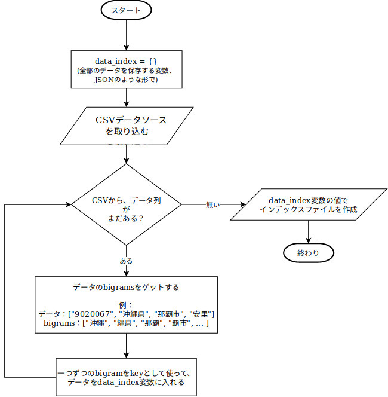

# 二次面接課題

二次面接課題のPythonを使って作られた提出物（コンソールアプリケーション）

## 前提条件

- [Python](https://www.python.org/downloads/) - 3.6.x (このバージョン以上)

`python --verson` で、Pythonのバージョンを確認できます。他のPCでは、Pythonが`python3`と呼ばれるので、それをチェックしてください。

`python3`の場合は、実行説明での`python`は、`python3`にしてください。

## 実行説明

#### インデックスファイルを作成する機能

```bash
python main.py generate_index
```

これで、インデックスファイルが作成されます。

違うデータソースを使いたいなら、`-s`か`--source`任意の引数を追加したら、できます。

```bash
python main.py generate_index -s <データソースのディレクトリ>
```

#### 検索し出力する機能

```bash
python main.py search
```

上記のコマンドを実行したら、コンソールアプリが入力に待つようになります。検索するキーワードを入力したら、コンソールで直接に住所レコードの結果が出力されます。

キーワードがなしで、enterボターンを押すと、コンソールアプリがクロースされます。

#### テスト

```bash
python tests.py -v
```

シンプルな単体テストも書いてありますので、上記のコマンドでテストが実行できます。

## 技術説明

このアプリでは、インデックスファイルを作成する機能と検索し出力する機能があります。両方は、`core`という モジュール にありますので、入り口点として（core モジュール を呼び出す）は、`main.py`です。



最初に、インデックスファイルのデータを保存するために`data_index`というdictionary変数（JSONみたいなPython言語のデータ種類）を定義しました。このデータ種類を使う理由は、検索する時には、データの引き出すことを簡単にするっていうことです。この変数のそれぞれのkeyの中には、keyにマッチするデータの配列があります。

例えば、`渋谷`というkeyなら、`data_index['渋谷']`の中には、このようなデータがあります：`[["9870113", "宮城県", "遠田郡涌谷町", "渋江"], ["0101642", "秋田県", "秋田市", "新屋渋谷町"], ...]`

そして、CSVデータソースをとりこめます。Indexのアルゴリズムは`N-Gram (N=2)`なので、データソースから、それぞれのデータ列の[bigrams](https://www.weblio.jp/content/bigram)をゲットしなければいけません。それをやって、bigramsをkeyとして使って`data_index`変数のインデックス配列にデータを追加します（上記の例のようにする）。

例えば、このデータ列、`["9020067", "沖縄県", "那覇市", "安里"]`、がある場合、下記が行います。

1. データ列の二番目から、四番目までのデータのbigramsをゲットする

   実際のbigramsは、下記に書いてあります。

   - 沖縄県 -> ["沖縄", "縄県"]
   - 那覇市 -> ["那覇", "覇市"]
   - 安里 -> ["安里"]

   でも、こういうやり方で、サンプル出力のような結果が出られません（`'渋谷' -> "9870113","宮城県","遠田郡涌谷町","渋江"`)。なので、「特別なbigrams」をゲットしました。特別なbigramsというのは、実際のbigramsも入っていますが、その三つの一つずつ文字列が残り（二つ）の文字列に繋がっています。また、bigramの反対も含めています。上記の例では、このbigramsがあります：

   [**"沖縄"**, "縄沖", "沖那", "那沖", "沖覇", "覇沖", "沖市", ""市沖", "沖安", "安沖", "沖里", "里沖", **"縄県"**, "県縄", "縄那", "那縄", "縄覇", "覇縄", "縄市", ""市縄", "縄安", "安縄", "縄里", "里縄", "県那", "那県", "県覇", "覇県", "県市", ""市県", "県安", "安県", "県里", "里県", **"那覇"**, "覇那", "那安", "安那", "那里", "里那", **"覇市"**, "市覇", "覇安", "安覇", "覇里", "里覇", "市安", "安市", "市里", "里市", **"安里"**, "里安"]

2. 全部のbigramを一つの配列に組み合わせて、一つずつ、keyとして使って、データ列を`data_index`変数に入れる

   - 組み合わせ：["沖縄", "縄県", "那覇", "覇市", "安里", ...]

   - `data_index`変数をbigram（keyとして）でアクセスして、配列があったら、データ列を追加しますが、ないなら、配列をt作成してデータ列を入れます。

     ```python
     # core/indexer.py
     for bigram in bigrams:
         if bigram in data_index:
             data_index[bigram].append(data_row)
         else:
             data_index[bigram] = [data_row]
     ```

   - `data_index`は、このようになります。

     ```python
     data_index = {
         "沖縄": [["9020067", "沖縄県", "那覇市", "安里"]],
         "縄県", [["9020067", "沖縄県", "那覇市", "安里"]],
         ...
     }
     ```

CSVのデータ列が全部引き出したら、インデックスファイルを作成します。Python言語で、`pickle`というpackageを使うと、dictionaryデータ種類がファイルに書けますので、それを使って、`data_index`変数の値でインデックスファイルを作成します。

リソース：[pickle - Python object serialization](https://docs.python.org/3/library/pickle.html)

インデックスファイルを作成できましたので、検索ができるようになりました。検索する時に、最初は、作成したインデックスファイルを取り込みます。それから、ユーザーの入力をもらって、入力した文字列の実際のbigramsをゲットします。

インデックスのデータは、dictionary種類なので、一つずつのbigramをdictionary keyとして使って、データを簡単に取得します。そのデータを組み合わせて、出力します。

以上